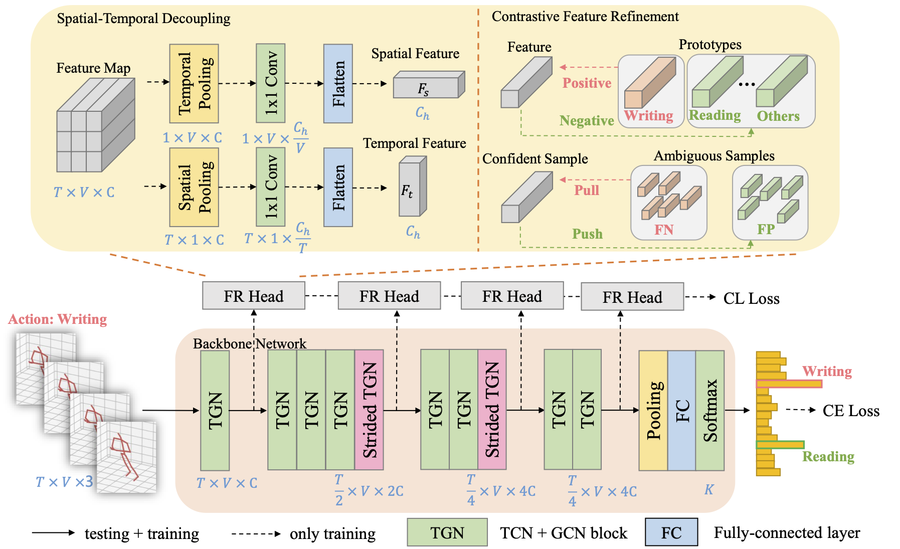

# FR-Head
This repo is the official implementation for [Learning Discriminative Representations for Skeleton Based Action Recognition](https://arxiv.org/abs/2303.03729). 

The paper is accepted to CVPR2023.

## Architecture

# Prerequisites

- Python >= 3.6
- PyTorch >= 1.1.0
- PyYAML, tqdm, tensorboardX

- We provide the dependency file of our experimental environment, you can install all dependencies by creating a new anaconda virtual environment and running `pip install -r requirements.txt `
- Run `pip install -e torchlight` 

# Data Preparation

### Download datasets.

#### There are 3 datasets to download:

- NTU RGB+D 60 Skeleton
- NTU RGB+D 120 Skeleton
- NW-UCLA

#### NTU RGB+D 60 and 120

1. Request dataset here: https://rose1.ntu.edu.sg/dataset/actionRecognition
2. Download the skeleton-only datasets:
   1. `nturgbd_skeletons_s001_to_s017.zip` (NTU RGB+D 60)
   2. `nturgbd_skeletons_s018_to_s032.zip` (NTU RGB+D 120)
   3. Extract above files to `./data/nturgbd_raw`

#### NW-UCLA

1. Download dataset from [here](https://www.dropbox.com/s/10pcm4pksjy6mkq/all_sqe.zip?dl=0)
2. Move `all_sqe` to `./data/NW-UCLA`

### Data Processing

#### Directory Structure

Put downloaded data into the following directory structure:

```
- data/
  - NW-UCLA/
    - all_sqe
      ... # raw data of NW-UCLA
  - ntu/
  - ntu120/
  - nturgbd_raw/
    - nturgb+d_skeletons/     # from `nturgbd_skeletons_s001_to_s017.zip`
      ...
    - nturgb+d_skeletons120/  # from `nturgbd_skeletons_s018_to_s032.zip`
      ...
```

#### Generating Data

- Generate NTU RGB+D 60 or NTU RGB+D 120 dataset:

```
 cd ./data/ntu # or cd ./data/ntu120
 # Get skeleton of each performer
 python get_raw_skes_data.py
 # Remove the bad skeleton 
 python get_raw_denoised_data.py
 # Transform the skeleton to the center of the first frame
 python seq_transformation.py
```

# Training & Testing

### Pretrained Models & Results

- We provide pretrained models under `./results` folder for producing the final results on all 5 benchmarks.
- Test the pretrained models directly or refer to `config.yaml` under the related subfolder to reproduce the model.
- The detailed results for provided models are displayed below:

| Benchmark   | Joint | Bone  | Bone motion | Joint Motion | 4-Modalities Ensemble |
|-------------|-------|-------|-------------|--------------|-----------------------|
| ntu/xsub    | 90.33 | 91.08 | 87.56       | 88.68        | 92.80                 | 
| ntu/xview   | 95.26 | 95.01 | 92.55       | 93.59        | 96.78                 |
| ntu120/xsub | 85.51 | 86.81 | 82.01       | 81.87        | 89.52                 |
| ntu120/xset | 87.32 | 88.14 | 83.91       | 83.98        | 90.94                 |
| NW-UCLA     | 94.40 | 93.10 | 89.44       | 92.89        | 96.77                 |

### Training

- Change the config file or assign the arguments using the command line depending on what you want.
- Refer to `./utils/config.py` for detailed description of all arguments.

```
# Example: training the default backbone (CTR-GCN) without FR-Head on NTU RGB+D 60 cross subject with GPU 0
python main.py --config config/nturgbd-cross-subject/rand_scale.yaml --work-dir results/ntu/xsub/demo --device 0
# Example: training the default backbone (CTR-GCN) with FR-Head
python main.py --config config/nturgbd-cross-subject/rand_scale.yaml --cl-mode ST-Multi-Level --w-multi-cl-loss 0.1 0.2 0.5 1 --work-dir results/ntu/xsub/demo --device 0
# Example: training FR-Head based on other backbones
python main.py --config config/nturgbd-cross-subject/rand_scale.yaml --cl-mode ST-Multi-Level --w-multi-cl-loss 0.1 0.2 0.5 1 --work-dir results/ntu/xsub/demo --device 0
```

- To train model with other modalities, setting `bone` or `vel` arguments in the config file or use the existed config file.

```
# Example: training models on NTU RGB+D 120 cross subject under bone modality
python main.py --config config/nturgbd120-cross-subject/rand_scale_bone.yaml --work-dir results/ntu120/xsub/demo --cl-mode ST-Multi-Level --w-multi-cl-loss 0.1 0.2 0.5 1 --device 0
```

### Testing

- To test the trained models saved in `./results`, run the following command:

```
python main.py --config config/ucla/default.yaml --work-dir results/NW-UCLA/demo --phase test --save-score True --weights results/NW-UCLA/FR-Head_Joint_94.40/runs.pt --device 0
```

- To ensemble the results of different modalities, run 
```
# Example: ensemble four modalities of pretrained modelson NTU RGB+D 120 cross set
python ensemble.py --dataset ntu120/xset --joint-dir results/ntu120/xset/FR-Head_Joint_87.32/ --bone-dir results/ntu120/xset/FR-Head_Bone_88.14/ --joint-motion-dir results/ntu120/xset/FR-Head_Joint_Motion_83.98/ --bone-motion-dir results/ntu120/xset/FR-Head_Bone_Motion_83.91/
```

## Acknowledgements

This repo is mainly based on [CTR-GCN](https://github.com/Uason-Chen/CTR-GCN). We also refer to [ST-GCN](https://github.com/yysijie/st-gcn), [2s-AGCN](https://github.com/lshiwjx/2s-AGCN) and [TCA-GCN](https://github.com/OrdinaryQin/TCA-GCN).

Thanks to the original authors for their excellent work!

# Citation

Please cite this work if you find it useful:.

      @inproceedings{zhou2023learning,
         title={Learning Discriminative Representations for Skeleton Based Action Recognition},
         author={Zhou, Huanyu and Liu, Qingjie and Wang, Yunhong},
         booktitle={Proceedings of the IEEE/CVF International Conference on Computer Vision},
         year={2023}
      }
